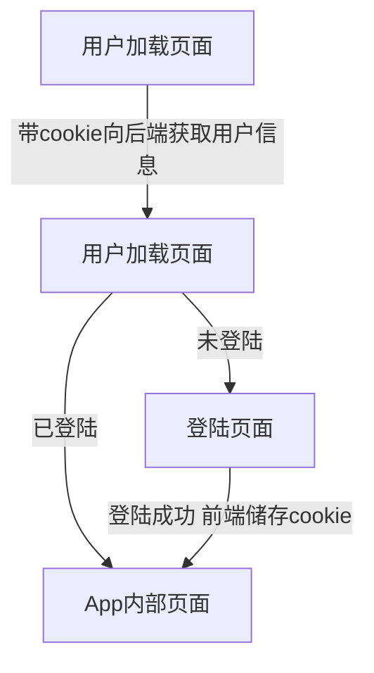

# 实时聊天招聘APP
## 描述
这是一款React + React Router + Redux 开发的高颜值实时聊天招聘APP，技术上使用React16 + Redux + React Router4开发复杂的单页面应用，并使用node.js + express + socket.io管理实时应用的后端
## 下载源码
```
git clone https://github.com/fangfeiyue/React-Redux-Recruitment-software.git
```
## 运行项目
```
npm install
npm start
```
## 技术选型
- 版本控制：git
- 开发工具：vscode
- 软件开发过程：敏捷开发
- 前端：React16 + Redux + React Router4 + antd-mobile
- 后端：node.js + express + socket.io
- 模块化方案：ES6 + Webpack
- 前后端分离方式：完全分离，纯静态方式
## 大纲
### 页面文件结构
- 组件放在component文件夹下面
- 页面放在container文件夹下面
- 页面入口获取用户信息，决定跳转到哪个页面
### 基于cookie用户验证
- express依赖cookie-parser,需要`npm install cookie-parser --save`
### 大体流程

## 知识点总结
### React开发环境
- create-react-app的使用
  - npm install -g create-react-app 
  - npm create-react-app 创建的项目名称
  - cd到项目目录，运行npm start 启动安装好的项目
  - 浏览器输入localhost:3000
  - npm install redux --save 安装第三方库
  - npm run eject 弹出配置文件，可以自定义配置webpack
  - 扩展package.json里的script字段，扩展 npm run命令
遇到的问题：在运行`npm install redux --save`安装redux时，报错
```
Failed to parse json
npm ERR! Unexpected token '/' at 8:5
npm ERR!     // webpack、eslint的配置都在react-scripts
npm ERR!     ^
npm ERR! File: /Users/fangfeiyue/Desktop/GuoAn/recruitment/package.json
npm ERR! Failed to parse package.json data.
```
原因：package.json文件中用了双斜杠注释
```
"dependencies": {
    "react": "^16.0.0",
    "react-dom": "^16.0.0",
    // webpack、eslint的配置都在react-scripts
    "react-scripts": "1.0.15"
},
```
解决办法：去掉双斜杠注释
- 对象赋值
```
//第一种
var name  = 'fang';
var obj   = {};
obj[name] = 'fei';
console.log(obj);//{fang: "fei"}
//第二种
var name  = 'fang';
var obj   = {
    name:'张'//取不到外面的变量
};
obj[name] = 'fei';
console.log(obj);{name: "张", fang: "fei"}
//第三种
var name  = 'fang';
var obj   = {
    [name]: '张'
};
console.log(obj);//{fang: "张"}
obj[name] = 'fei';
console.log(obj);//{fang: "fei"}
//第四种
var name = 'fang';
var obj = {
    name: name
    print: function(){
        console.log(this.name);
    }
}
可简写为：
var name = 'fang';
var obj = {
    name,
    print(){
        console.log(this.name);
    }
};
```
### [Express基础应用](http://www.expressjs.com.cn/)
- Express简单使用
    - 安装
    ```
    npm install express --save
    ```
    - 简单使用--创建server.js，写入以下内容
    ```
    const express = require('express');
    // 新建app
    const app = express();

    // 返回html 
    app.get('/', function(req, res){
        res.send('<h1>hello express,I am learning</h1>');
    });

    // 返回json数据
    app.get('/data', function(req, res){
        res.json({name: 'learning', type: 'react'});
    });

    app.listen(9093, function(){
        console.log('Node app start at port 9093');
    });
    ```
    - 启动
    ```
    node server.js
    ```
    这样用有个缺点，每次修改server.js的文件内容都要停止服务然后再启动，这样太麻烦了，我们可以使用`nodemon`让node自动启动
    - 安装nodemon
    ```
    npm install -g nodemon
    ```
    - 使用nodemon
    ```
    nodemon server.js
    ```
- Express常用的几个特性
    - app.get、app.post分别开发get和post接口
    - app.use使用模块
    - res.send（文本）、res.json（json）、res.sendfile（文件）响应不同的内容
### [MongoDB](https://www.mongodb.com/)
- 安装Homebrew (MAC),其他安装方式见[官网](https://www.mongodb.com/download-center#community)
```
brew install mongodb
```
如果报`brew: command not found`，可能是没有安装Homebrew，在终端执行
```
ruby -e "$(curl -fsSL https://raw.githubusercontent.com/Homebrew/install/master/install)"
```

用homebrew安装mongodb一直报错，切换源也不行，实在没有没办法只能手动安装了
- 手动安装MongoDB
```
# 进入 /usr/local
cd /usr/local

# 下载
sudo curl -O https://fastdl.mongodb.org/osx/mongodb-osx-x86_64-3.4.2.tgz

# 解压
sudo tar -zxvf mongodb-osx-x86_64-3.4.2.tgz

# 重命名为 mongodb 目录

sudo mv mongodb-osx-x86_64-3.4.2 mongodb

安装完成后，我们可以把 MongoDB 的二进制命令文件目录（安装目录/bin）添加到 PATH 路径中：
export PATH=/usr/local/mongodb/bin:$PATH
```
- 运行 MongoDB
```
1、首先我们创建一个数据库存储目录 /data/db：
sudo mkdir -p /data/db

2.启动 mongodb，默认数据库目录即为 /data/db：
sudo mongod

# 如果没有创建全局路径 PATH，需要进入以下目录
cd /usr/local/mongodb/bin
sudo ./mongod

3.再打开一个终端进入执行以下命令：
$ cd /usr/local/mongodb/bin 
$ ./mongo

运行成功的提示：
MongoDB shell version v3.4.2
connecting to: mongodb://127.0.0.1:27017
MongoDB server version: 3.4.2
Welcome to the MongoDB shell.
……
> 1 + 1
2
> 

4.这时，可以打开浏览器输入 http://127.0.0.1:27017/。

浏览器中显示
It looks like you are trying to access MongoDB over HTTP on the native driver port.

5.如果不进行近一步操作可以ctrl+c退出
```
- Mongodb和nodejs的使用
    - 安装Mongoose
    ```
    npm install mongoose --save
    ```
    - 使用
    ```
    //server.js
    const mongoose = require('mongoose');

    // 连接mongo
    const DB_URL = 'mongodb://127.0.0.1:27017/test_mongo';
    mongoose.connect(DB_URL);
    mongoose.connection.on('connected', function(){
        console.log('mongo connect success');
    });

    // 类似于mysql的表， mongo里面有文档、字段的概念
    const User = mongoose.model('user', new mongoose.Schema({
        user: {type:String, require: true},
        age: {type: Number, require: true} 
    }));

    //新增数据
    User.create({
        user: 'xiao',
        age: 18
    }, function(err,  doc){
        if (!err){
            console.log(doc);
        }else{
            console.log(err);
        }
    });

    // 删除数据
    User.remove({age: 18}, function(err, doc){
        console.log(doc);
    });

    // 更新数据
    User.update({'user':'xiao'}, {'$set':{age:80}}, function(err, doc){
       console.log(doc);
    });

    // 获取mongo的数据
    User.find({user: 'xiao'}, function(err, doc){
        res.json(doc);     
    });

    // 仅查找一条
    User.findOne({user: 'xiao'}, function(err, doc){
        res.json(doc);     
    });

    //查找并更新
    User.findByIdAndUpdate(userId, body, function(err, doc){
        const data = Object.assign({}, {
            user: doc.user,
            type: doc.type
        }, body);
        return {code: 0, data};    
    });
    ```
- [mongodb可视化工具](https://robomongo.org/download)
### React
- React16是第一个核心代码重写的版本，整体API变化不大，主要变更了错误处理、生命周期、打包，对开发影响不是特别大
- 安装
```
npm install --save react
```
- React生命周期


### antd-mobile组件使用
- 安装
```
npm install antd-mobile --save-dev
```
- js中引入需要的控件，这里以Button为例
```
import { Button} from 'antd-mobile';
class Jun extends Component{
  constructor(props){
    super(props);
    this.state = {
      solids: ['护长','呼啦圈','三明治','武夷星']
    };
  }
  render(){ 
    return <Button type="primary" onClick={this.sayYes}>是否遵从命令</Button>;
  };
}
```
- antd-mobile按需加载
    - 安装babel-plugin-import
    ```
    npm install babel-plugin-import --save-dev
    ```
    - package.json中配置
    ```
    "babel": {
        "presets": [
        "react-app"
        ],
        "plugins": [
        ["import", { "libraryName": "antd-mobile", "style": "css" }]
        ]
    }
    ```
### Redux状态管理与React-router 
- Redux是什么
    - 专注状态管理，和react解耦
    - 单一状态，单向数据流
    - 核心概念:store、state、action、reducer
- redux最基本的使用
```
 import { createStore } from 'redux';
 
 function counter(state=0, action){
    switch(action.type){
        case 'INCREASE':
            return state + 1;
        case 'DECREASE':
            return state - 1;
        default:
            return state;
    }
 }

 function listener(){
    //  获取state
     const currState = store.getState();
     console.log(`现在的值为${currState}`);   
}

//  新建store
 const store = createStore(counter);

 store.subscribe(listener);

//  派发事件，传递action
 store.dispatch({
     type: 'INCREASE'
 });
```  
- React和redux的简单使用
    - 新建index.redux.js，输入以下内容
    ```
    const INCREASE = 'INCREASE';
    const DECREASE = 'DECREASE';

    export function counter(state = 0, action){
        switch(action.type){
            case INCREASE:
                return state + 1;
            case DECREASE:
                return state - 1;
            default: 
                return state;
        }
    }

    export const decrease = () => ({
        type: DECREASE
    });

    export const increase = () => ({
        type: INCREASE
    })
    ```
    - APP.js
    ```
    import React, { Component } from 'react';
    import { increase, decrease } from './index.redux';

    class App extends Component{
        render(){
            const store = this.props.store;
            const num = store.getState();
            return (
                <div>
                    <div>现在的值为{num}</div>
                    <button onClick={() => store.dispatch(increase())}>+</button>
                    <button onClick={() => store.dispatch(decrease())}>-</button>
                </div>
            );
        };
    }

    export default App;
    ```
    - index.js
    ```
    import React from 'react';
    import ReactDOM from 'react-dom';
    import {createStore} from 'redux';
    import App from './App';
    import { counter } from './index.redux';

    const store = createStore(counter);

    const render = () => { 
        ReactDOM.render(<App store={store}/>, document.getElementById('root'));
    };

    render();

    store.subscribe(render);
    ```
- Redux处理异步的操作
    - Redux处理异步需要redux-thunk插件
        - 安装
        ```
        npm install redux-thunk --save
        ```
        - 使用applyMiddleWare开启thunk中间件
        ```
        // index.js
        import {createStore, applyMiddleware} from 'redux';
        import thunk from 'redux-thunk';
        const store = createStore(counter, applyMiddleware(thunk));
        //index.reducer.js
        export const  increaseAsy = () => {
            return dispatch => {
                setTimeout(function() {  
                    dispatch(increase());
                }, 2000);     
            }
        }
        ```
        - Action可以返回函数，使用dispatcht提交action
    - 使用react-reduxl连接react和redux
- Redux调试工具的使用
    - 去谷歌应用商店安装Redux DevTools插件
    - 新建store的使用判断window.devToolExtension
    - 使用compose结合thunk和window.devToolExtension
    - chrome调试窗redux选项卡，实时看到state
    ```
    // index.js
    import {createStore, applyMiddleware, compose} from 'redux';
    // 使用compose结合thunk和window.devToolExtension
    const store = createStore(counter, compose(
        applyMiddleware(thunk),
        // 新建store的使用判断window.devToolExtension
        window.devToolsExtension ? window.devToolsExtension() : f => f
    ));
    ```
- React-Redux提供了Provider和connectl两个接口
    - 安装
    ```
    npm install react-redux --save
    ```
    - Provider组件在应用最外层，传入store即可，只用一次就行
    ```
    //index.js
    ...
    import { Provider } from 'react-redux';
    ...
    ReactDOM.render(
        <Provider store={store}>
            <App/>
        </Provider>,
        document.getElementById('root')
    );
    ```
    - Connect负责从外部获取组件需要的参数
    ```
    //App.js
    ...
    import { connect } from 'react-redux';
    ...
    const mapStateToProps = (state, ownProps) => {
        return {
            num: state
        }
    }
    export default connect(
        mapStateToProps, 
        {increase, decrease, increaseAsy}
    )(App);
    ```
    - Connect可以用装饰器的方式来写
        - npm run eject弹出个性化配置
        - npm install babel-plugin-transform-decorators-legacy插件
        - package.json里babelj加plugins配置 
        ```
        "babel": {
            "presets": [
            "react-app"
            ],
            "plugins": [
                "transform-decorators-legacy"
            ]
        }

        //App.js
        ....
        const mapStateToProps = (state, ownProps) => {
            return {
                num: state
            }
        }
        @connect(mapStateToProps, {increase, decrease, increaseAsy})
        class App extends Component{
            render(){
                return (
                    <div>
                        <div>现在的值为{this.props.num}</div>
                        <button onClick={this.props.increase}>+</button>
                        <button onClick={this.props.decrease}>-</button>
                        <button onClick={this.props.increaseAsy}>++</button>
                    </div>
                );
            };
        }

        export default App;
        ``` 
### React-Router4
- url参数，Route组件参数可以用冒号标识参数
- Redirect组件 跳转
```
// index.js
import { BrowserRouter, Route, Link, Redirect } from 'react-router-dom';
ReactDOM.render(
    <Provider store={store}>
        <BrowserRouter>
            <div>
                <ul>
                    <li><Link to='/'>test1</Link></li>
                    <li><Link to='/test2'>test2</Link></li>
                    <li><Link to='/test3'>test3</ Link></li>
                </ul>
                <Redirect path='/'></Redirect>
                <Route path='/' exact component={App}></Route>
                <Route path='/test2' component={TestRouter2}></Route>
                <Route path='/test3' component={TestRouter3}></Route>
            </div>
        </BrowserRouter>
    </Provider>,
    document.getElementById('root')
);
```
- Switch只渲染一个Route组件
```
// index.js
import { BrowserRouter, Route, Link, Redirect, Switch  } from 'react-router-dom';
ReactDOM.render(
    <Provider store={store}>
        <BrowserRouter>
            <div>
                <ul>
                    <li><Link to='/'>test1</Link></li>
                    <li><Link to='/test2'>test2</Link></li>
                    <li><Link to='/test3'>test3</ Link></li>
                </ul>
                <Switch>
                {/*只渲染第一次命中的,可用于处理一些特殊页面，比如404*/}
                    <Route path='/' exact component={App}></Route>
                    <Route path='/test2' component={TestRouter2}></Route>
                    <Route path='/test3' component={TestRouter3}></Route>
                    <Route path='/:location' component={TestRouterParam}></Route>
                </Switch>
            </div>
        </BrowserRouter>
    </Provider>,
    document.getElementById('root')
);
``` 
遇到的问题：程序运行报如下错误
```
Objects are not valid as a React child (found: object with keys {counter, auth}). If you meant to render a collection of children, use an array instead.
```
原因：根据报错分析，很显然我们迭代的是一个对象,其含有的key为{counter, auth}，找了半天代码才发现给num赋值的时候只写了state没有取出里面的counter
```
//App.js
const mapStateToProps = (state, ownProps) => {
    return {
        num: state.counter
    }
}
````
解决办法：
```
//App.js
const mapStateToProps = (state, ownProps) => {
    return {
        num: state.counter
    }
}
```

- withRouter
如果不是Route，输出this.props.history等路由相关的属性会报错，怎么才能输出这些属性呢？，可以用withRoter
    - 使用
    ```
    import { withRouter } from 'react-router-dom';
    @withRouter
    class AuthRoute extends Component{
        componentDidMount(){
            // 获取用户信息
            axios.get('/user/info').then(res => {
                if (res.status === 200){
                    if (res.data.code == '0'){
                        // 登录了
                    }else{ // 没有登录
                        console.log('this.props.history', this.props.history);
                    }
                    console.log(res.data);
                }
            });
        }

        render(){
            return <h2>验证用户</h2>
        };
    }
    export default AuthRoute;
    ```
### 前后端连调

端口不一致，使用proxy配置转发,axios拦截器，统一loading处理
- 使用axios发送异步请求
    - 安装axios
    ```
    npm install axios --save
    ```
    - axios.interceptors设置拦截器，比如全局的loading
    ```
    //config.js
    import axios from 'axios';
    import { Toast } from 'antd-mobile';
    // 拦截请求
    axios.interceptors.request.use(function(config){
        Toast.loading('加载中', 0);
        return config;
    });

    // 拦截响应
    axios.interceptors.response.use(function(config){
        setTimeout(function() {
            Toast.hide();
        }, 2000);
        return config;
    });
    ```
    - axios.get,axios.post发送请求，返回promise对象
### 注册页面
- 注册页面的接口使用了post接口，但是不能直接使用express.post，需要安装body-parser
    - express使用post需要安装body-parser
    ```
    npm install body-parser --save
    ```
- 注册页面密码需要加密，这里使用md5加密用的utility进行加密
    - 安装
    ```
    npm install utility --save
    ```
    - 使用
    ```
    const utils = require('utility');
    const pwd = utils.md5('xxxx');
    ```
- 仅仅像上面一样进行加密密码还是不安全的，有些网站会存储常用的md5字符串如[CMD5](http://cmd5.com/),所以我们要采取更好的措施处理加密，这里我采取加盐和两层md5相结合的方式
```
function md5Password(pwd){
    const salt = 'ffy_love_gdd_955_HJASDL  8@#@!$%$_^&^*^&^';
    return utils.md5(utils.md5(pwd+salt));
}
```
- 登录成功后，接口返回了登录成功的信息，但里面包含pwd，但pwd并不是我们想要的，此时需要接口过滤掉pwd,User.findOne方法中增加{pwd: 0}进行过滤`User.findOne({user: user, pwd: md5Password(pwd)},{pwd: 0}, function(err, doc){})`具体代码如下：
```
// 用户登录
Router.post('/login', function(req, res){
    const { user, pwd } = req.body;
    User.findOne({user: user, pwd: md5Password(pwd)},{pwd: 0}, function(err, doc){
        if (!doc){
            return res.json({code: 1, msg:'用户名或者密码错误'});
        }

        return res.json({code:0, data:doc});
    });
});
```

## 传说中的彩蛋
- [vConsole](https://github.com/Tencent/vConsole)手机端调试必备神器，可输出console信息
- [GIF屏幕录制工具-licecap](https://www.cockos.com/licecap/)
## 说明
如果对您有帮助，您可以点右上角 "Star" 支持一下 谢谢！ ^_^

或者您可以 "follow" 一下，我会不断开源更多的有趣的项目
## 个人简介
作者：房飞跃

博客地址：[前端网](http://www.qdfuns.com/house/31986/note)  [博客园](https://www.cnblogs.com/fangfeiyue)  [GitHub](https://github.com/fangfeiyue)

职业：web前端开发工程师

爱好：探索新事物，学习新知识

座右铭：一个终身学习者

## 联系方式
坐标：北京

QQ：294925572

QQ技术交流群：678941904 ( 欢迎加入此群，与志同道合的朋友一起进步 )

微信：


## 赞赏
觉得有帮助可以微信扫码支持下哦，赞赏金额不限，一分也是您对作者的鼎力支持


